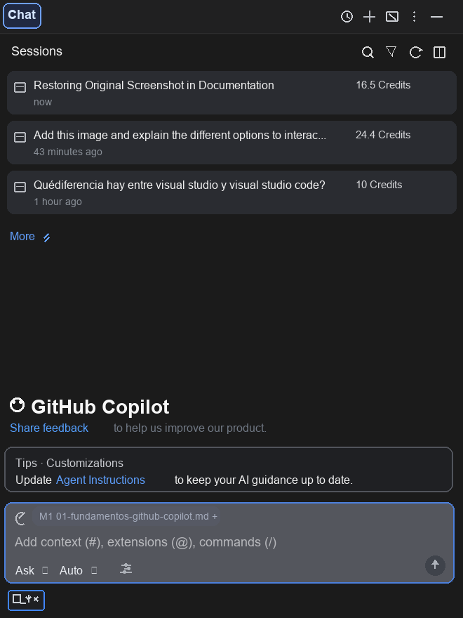

# Sesión 1: GitHub Copilot - Tu primer asistente de IA integrado en tu IntelliJ

Instalaremos el plugin de GitHub Copilot en IntelliJ IDEA, veremos los elementos principales del panel y lo usaremos para enviar nuestro primer prompt en modo Ask siguiendo 3 reglas básicas de seguridad.

## Duración
1 hora

## Audiencia
- Desarrolladores software sin experiencia previa con IA generativa

## Prerrequisitos
- [ ] Puedo utilizar mi IntelliJ IDEA para mi trabajo normal como desarrollador de software.
  - [ ] IntelliJ IDEA instalado.
  - [ ] IntelliJ IDEA actualizado a la última versión: ver `Help / Check for Updates`.
- [ ] Cuenta de GitHub con suscripción a Copilot activa (ver `github.com/settings/copilot`)
- [ ] Acceso de red a `github.com` desde el IDE (proxy configurado)

## Objetivos
Al finalizar la sesión, el alumno será capaz de:
- [ ] Instalar y abrir el plugin de GitHub Copilot en IntelliJ IDEA.
- [ ] Verificar que la sesión de GitHub Copilot está activa.
- [ ] Reconocer los elementos principales del panel del plugin de GitHub Copilot: barra superior, zona de sesiones, zona de prompt.
- [ ] Explicar con mis palabras qué son un prompt, una sesión y el contexto en GitHub Copilot.
- [ ] Enviar mi primer `prompt` en modo `Ask` con esfuerzo Low en el entorno de ejecución de Copilot y modelo de elección del alumno.
  - [ ] Identificar `prompt` en modo `Ask` que requieran un modelo ligero con esfuerzo Low
  - [ ] Identificar `prompt` en modo `Ask` que requieran un modelo pesado con esfuerzo High

---

## 1. Instalación y configuración plugin GitHub Copilot en IntelliJ IDEA
1. Instalar plugin **GitHub Copilot** desde **Settings/Preferences > Plugins > Marketplace**.
2. Reiniciar el IDE.
3. Autorizar la cuenta de GitHub.

## 2. Overview del plugin GitHub Copilot

### Barra superior
- **Reloj (historial)**: abre el historial de sesiones recientes.
- **AI Credit usage**: muestra el consumo de créditos de IA de tu plan (usados vs. disponibles) y el ciclo de facturación. Útil para controlar el gasto de las sesiones.
- **`+` (nueva sesión)**: inicia una conversación nueva, limpiando el contexto actual.
- **Customizations**: acceso a las personalizaciones de Copilot: instrucciones del agente, prompts personalizados, modos de chat y MCP servers.
- **Menú `⋮`**: opciones adicionales de visualización.
- **Botón `—`**: oculta el panel del plugin.

### Sección "Sessions"
- Lista de conversaciones recientes con su coste en **Credits** y antigüedad; permite reanudar sesiones anteriores.
- Iconos de la barra de sesiones: **buscar** sesiones, **filtrar**, **refrescar** la lista y alternar la vista del panel lateral.
- **Archivar** en cada sesión: archiva la conversación.
- **More >**: expande el historial completo.

### Zona de prompt (parte inferior)
- **Clip (añadir contexto)**: adjunta imágenes o ficheros como contexto.
- **Chip de fichero** (ej. `01-fundamentos-github-copilot.md`): contexto explícito añadido; el `+` permite añadir más ficheros/símbolos (`#file`).
- **Campo "Ask Copilot"**: donde escribes el prompt. Cada envío inicia o continúa una conversación ("session"): todo lo que escribes y las respuestas se acumulan como contexto para las siguientes.
- **Selector de modo (`Agent/Ask/Plan`)**: cambia entre **Agent** (ejecuta tareas modificando el proyecto), **Ask** (solo preguntar, sin modificar código) y **Plan** (diseñar antes de construir: descompone problemas complejos, sugiere arquitecturas y crea planes de implementación detallados).
- **Selector de modelo** (ej. `Kimi K3`): elige el LLM a usar según la tarea (velocidad vs. razonamiento).
- **Selector de esfuerzo** (ej. `Low`): nivel de razonamiento del modelo (Low/Medium/High); más esfuerzo = mejor razonamiento pero más coste y latencia.
- **Botón enviar (`↑`)**: envía el prompt.
- **Entorno de ejecución** (`Local/GitHub/Cloud`): define dónde ejecutar el código y los cambios generados.

#### Modos de ejecución: Ask, Agent, Plan
- **Ask**: responder dudas, explicar código o proponer ideas **sin modificar archivos**. Úsalo cuando no quieras realizar cambios.
- **Agent / Edits**: aplicar cambios directamente en el proyecto.
- **Plan**: descomponer tareas grandes en pasos antes de ejecutar.

## 3. Antes de tu primer prompt

### Conceptos clave antes de empezar

- **Prompt**: el mensaje que escribes al asistente. Es la unidad básica de interacción con la IA.
  - Cuanto más claro y específico, mejor respuesta.
  - En esta sesión lo descubrirás lo más básico
  - En la [Sesión 2](./02-fundamentos-ia-swe.md#nivel-2---modo-ask-como-chat-con-consultor-técnico) lo perfeccionarás
  - En la [Sesión 3](03-recursos-ia-01-prompts-instructions.md#prompts-avanzados) veremos conceptos avanzados para reutilizarlos.
- **Session (sesión)**: una conversación completa con Copilot. Todos los prompts y respuestas de una sesión se acumulan: lo dicho antes condiciona lo que responde después. Cuando cambias de tema, conviene iniciar una sesión nueva (botón `+`) para no "contaminar" el contexto.
- **Contexto**: la información que Copilot tiene disponible para responder: el código abierto en el editor, los ficheros que adjuntas (clip o `#file`) y el historial de la sesión. La IA no "sabe" nada de tu proyecto salvo lo que esté en el contexto.
- **Modelo (LLM)**: el motor de IA que genera las respuestas. Hay modelos rápidos/ligeros y modelos potentes/pesados; se elige en el selector de modelo.
- **Esfuerzo (Low/Medium/High)**: cuánto "razona" el modelo antes de responder. Más esfuerzo = mejor calidad en tareas complejas, pero más coste en créditos y más latencia.
- **Créditos de IA**: la "moneda" que consume cada interacción. Cada modelo y nivel de esfuerzo tiene un coste distinto (ver *AI Credit usage*).

### 3 reglas de seguridad
1. **No compartas datos sensibles**: secretos, credenciales, datos personales o código sujeto a propiedad intelectual. Regla de oro: si no lo publicarías en un foro público, no lo pongas en un prompt.
2. **Los créditos son limitados**: cada interacción consume créditos de IA (revísalos en *AI Credit usage*). Cada modelo y esfuerzo tiene un coste diferente. Experimenta con los diferentes modelos y esfuerzos para calibrar qué funciona mejor para cada tarea.
3. **La IA se equivoca**: nunca uses su salida sin revisarla. En la Sesión 2 aprenderás a sacarle partido con criterio.

## 4. Tu turno: juega seguro
Ya tienes el plugin instalado, conoces el panel y sabes las 3 reglas. Antes de la próxima sesión:
- [ ] Envía tu primer prompt en modo **Ask** (ej. "explica qué hace este método" sobre código de tu proyecto).
- [ ] Prueba a adjuntar un fichero como contexto con el clip o `#file`.
- [ ] Revisa tu consumo en **AI Credit usage** tras la sesión de juego.
- [ ] Anota 1 cosa que te haya sorprendido y 1 duda para la Sesión 2.
